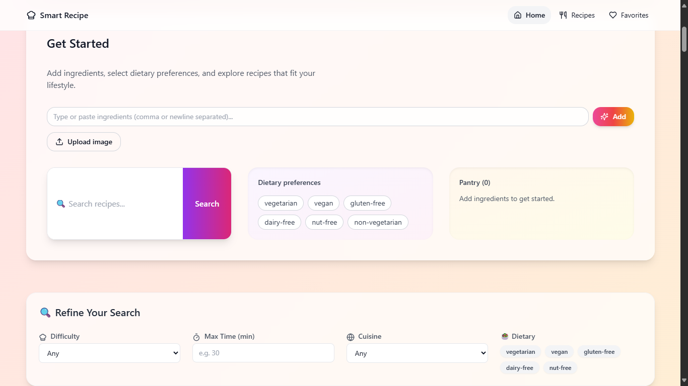
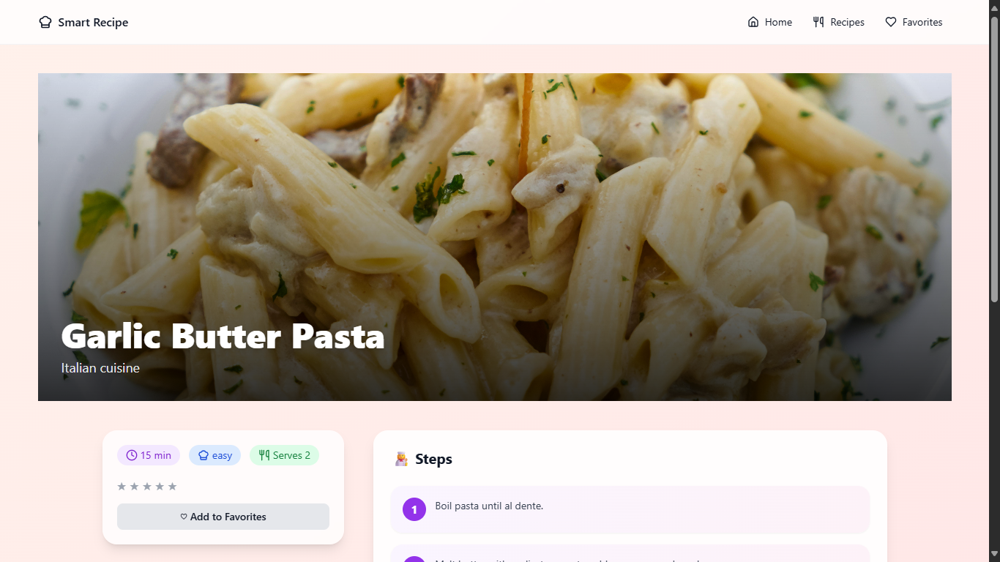

# 🍳 Smart Recipe Generator

A modern **AI-powered recipe discovery app** built with **Next.js 14**, **Tailwind CSS**, and **TypeScript**.  
Users can add ingredients from their pantry, apply dietary filters, search by cuisine or difficulty, save favorites, and rate recipes.  
The app generates **personalized recipe suggestions** instantly.

---

## 🌐 Live Demo
👉 [Deployed App on Vercel](https://smart-recipe-generator-ashen.vercel.app/)

---

## 📂 Repository
👉 [GitHub Repository](https://github.com/AbhishekSriv6387/smart-recipe-generator)

---

## ✨ Features
- 🔍 Search recipes by name, cuisine, difficulty, or tags  
- 🥕 Pantry-based recipe recommendations  
- 🥗 Dietary filters (vegan, vegetarian, gluten-free, etc.)  
- ⭐ Save **favorites** (stored in browser `localStorage`)  
- ❤️ Rate recipes and get personalized suggestions  
- 🎨 Beautiful responsive UI with Tailwind & Framer Motion  
- ☁️ Deployed seamlessly on **Vercel**

---

## 🛠️ Tech Stack
- [Next.js 14](https://nextjs.org/) – React framework
- [TypeScript](https://www.typescriptlang.org/)
- [Tailwind CSS](https://tailwindcss.com/) – Styling
- [Framer Motion](https://www.framer.com/motion/) – Animations
- [Lucide Icons](https://lucide.dev/) – Icons

---

## 🚀 Getting Started (Local Setup)

```bash
# Clone repository
git clone https://github.com/AbhishekSriv6387/smart-recipe-generator.git

cd smart-recipe-generator

# Install dependencies
npm install

# Run locally
npm run dev

# Build for production
npm run build
```

The app will be available at **https://smart-recipe-generator-ashen.vercel.app/**

---

## 📸 Screenshots
| Home Page | Recipe Detail | Favorites |
|-----------|---------------|-----------|
|  |  |  |

---

## 📝 Innovative Approach (200 words)

The Smart Recipe Generator was designed to help users discover meals tailored to their pantry and preferences. My approach focused on **simplicity, modularity, and user experience**. At its core, the app uses a pantry-based ranking function: users list ingredients, and recipes are ranked based on overlap. This transforms decision-making into a guided, smart process.

I leveraged **Next.js 14** for scalability and smooth deployment with Vercel. To avoid server-side rendering issues with `localStorage`, I carefully isolated client-only logic using `useEffect` and hydration checks. This ensures favorites and ratings persist across sessions without database dependencies, keeping the app lightweight and reliable.

Filters for cuisine, difficulty, dietary preference, and time were implemented as composable constraints, allowing users to refine results flexibly. A recommendation engine further enhances personalization by suggesting recipes from similar cuisines as the user’s favorites, with fallbacks to top-rated dishes.

From a UX standpoint, I prioritized clarity and delight—animated transitions via **Framer Motion**, responsive layouts, and visually appealing cards make interaction smooth. All recipes and assets are modular, so extending the dataset requires no code changes. This balance of thoughtful architecture and engaging design ensures the project remains both **practical and scalable**.

---

## 📦 Deliverables
1. **Working Application URL** (Vercel)
2. **GitHub Repository** with full source code + README
3. **Brief Write-Up** (this document)

---

## 👨‍💻 Author
**Abhishek Srivastava**  
📧 abhisheksriv6387@gmail.com  
🌐 [GitHub Profile](https://github.com/AbhishekSriv6387)
